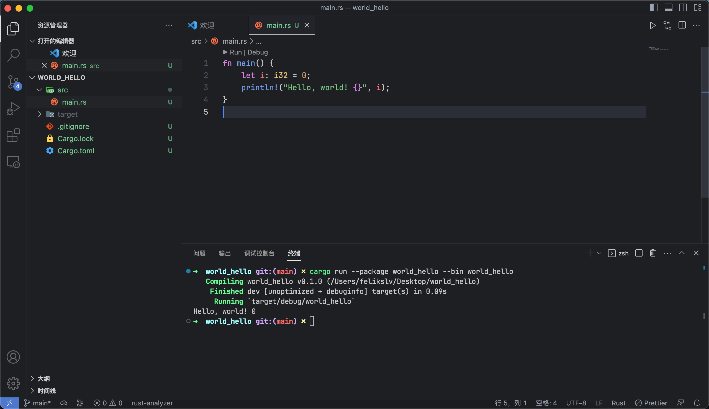

# New Dark

**_Not released_**

Based On [OneDarkPro](https://github.com/Binaryify/OneDark-Pro) And JetBrains New Dark



## Temporary installation

```shell
sudo cp -R NewDarkTheme ~/.vscode/extensions
```

## Suggest Editor Settings

```json
"editor.fontSize": 14,
"editor.fontFamily": "JetBrains Mono",
"editor.lineHeight": 22,
"editor.fontLigatures": true,
```
